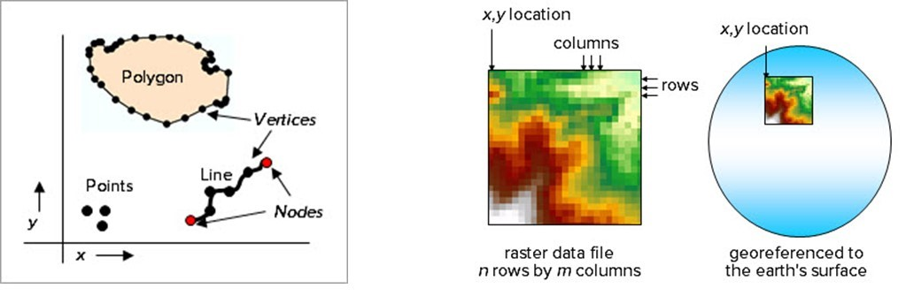
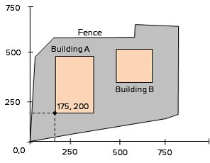
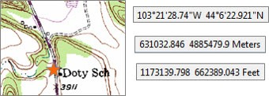
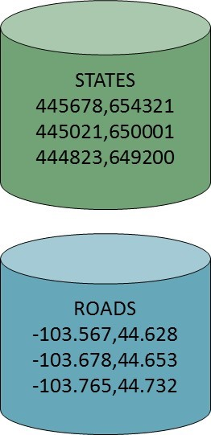
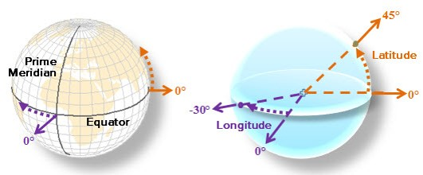
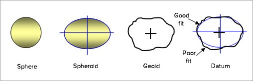
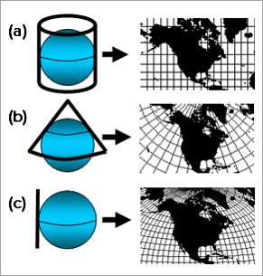
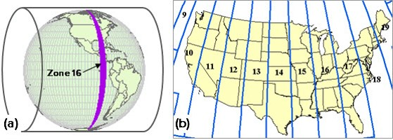
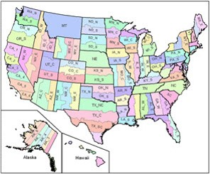

@title[Coordinate Systems in GIS]
Coordinate Systems in GIS
-------------------------------
### @fa[globe fa-5x]

###### Use the space bar to advance the slides
---
### The Plan

- Review of Coordinate Systems, Datums, and Projections
- Projections: Distortion and Compromise
- Projection Selection: Guiding Principles
- Working with Coordinate Systems in ArcGIS Pro
---
#### Coordinate Systems, Datums, and Projections: A Review
Coordinate systems define how locations are referenced by their *x*, *y*, and sometimes *z* values in a GIS dataset

+++
#### Coordinate Space

The specific *x*, *y* values and their units are known as the **coordinate space**. Could be *arbitrary*, and locally defined, or standardized for cross referencing with other data. 

+++
#### Coordinate Systems: Two Types

Coordinate Systems in GIS can be either **unprojected/geographic**, or **projected**...

- Unprojected |
    - Based on spherical coordinates |
	- Units: Degrees of Lat/Long |
- Projected |
    - Mathematical Transformation from sphere > flat surface/plane |
	- 3 dimensional surface > 2D surface |
+++
Projected vs Unprojected...

+++
#### Geographic Coordinate Systems
A **GCS** uses latitude and longitude to store feature locations in *Decimal Degrees*. Location data in *Degrees, Minutes, and Seconds* must be converted, keeping	 at least 5-6 decimal places. 
	
	
+++
#### Datums

A **datum** defines a **spheroid** that is aligned with Earth's shape (the **geoid**). A **local datum** prioritizes best fit for a particular location, while a **geocentric datum** seeks the best fit for all locations. 

+++
#### Datums for North America
- Several datums may be used for spatial data in North America...
    - NAD27: North American Datum 1927 - Clarke 1866 spheroid
    - NAD83: North American Datum 1983 - GRS80 spheroid. **Current most popular/default datum**
    - WGS84: World Geodetic Survey 1984 - Geocentric datum. Default for many GPS units.

More: https://desktop.arcgis.com/en/arcmap/latest/map/projections/datums.htm
+++
#### Projections
**Map projections** are complex mathematical models that translate the Earth's curved surface to the flat 2D surface of a paper map. 

Each projection is based on a **datum** and **GCS** that define the shape of the Earth. Different datums/GCSes could result in coordinate shifts
+++
#### Types of projections
Map projections project Earth's surface onto a shape, like a **cylinder**, **cone**, or **plane**. Each shape yields different properties. 

+++
#### Tradeoffs...
*All* map projections confer some distortion of one or more of the following properties...

- Direction
- Distance
- Shape
- Area
+++
#### Tradeoffs
*Some* projections preserve certain properties at the expense of others...

- Cylindrical: usually preserve **direction** and **shape** (navigational maps)
- Conic: usually preserve **area** and **distance** (small scale maps)
- Planar: usually preserve **area** and **distance**
+++

+++
#### Projection Parameters
Map projections are defined by their type, and several parameters specific to the region of interest...

- Central Meridian: Origin of *x* coordinates/longitude
- Latitude of Origin: Origin of *y* cooridantes/parallels
- Standard Parallels: Latitudes where projection intersects spheroid
- False easting/northing: Constants added to coordinates to keep all values positive. 
+++
#### Projection Selection
Selecting a projection/coordinate system depends on *map purpose*, as well as *map scale*. For small scale maps, distortion is *inevitable*. 

- Navigational maps: Cylindrical projection to preserve direction and shape
- Continental maps: 
    - If distance is important - conic or azimuthal *equidistant* projection
    - If area more important - conic or azimuthal *equal area* projection
- General mapping: conformal or compromise projection
+++
#### Projection Selection

For large scale maps, distortion is less of a concern. Choose a regionally appropriate projection, like a **UTM** or **State Plane** projection. 
+++
#### UTM Projections
Univeral Tranverse Mercator (UTM) defines 60 zones, both North and South, for the entire globe. If working in a single UTM zone, all four map properties are preserved adequately. 

+++
#### State Plane Coordinate System
In the United States, the State Plane system offers an alternative to UTM. Very large scale, high accuracy maps often use State Plane. As long as your data fit within a single zone, very low distortion results. 

+++
#### State Plane Example
##### LOJIC Data
https://www.lojic.org/data/projection-information
+++
#### Coordinate Systems in GIS
One of the most common issues in GIS is data that do not align properly. Typically this is caused by one of several problems. 

1. The spatial reference is incorrect or **undefined** 
2. The GSC or datum is incorrectly identified **NAD27 or WGS84??**
3. The data have been improperly entered/coded **data quality issues**

https://support.esri.com/en/technical-article/000005060 
+++
#### Defining Projections
If the spatial reference is missing (check the layer properties), try to determine the correct projection.
- Look to the source! Is there metadata?
- Examine the data in the map. Can the units tell you anything? 
- Trial and error! Last resort, but you might get lucky!
+++
#### Defining Projections

+++
#### Reprojecting Data
The **Project** tool will reproject a dataset from one projection to another. It is **not the same as Define Projection**. 

You may use the Project tool to reproject a number of datasets to the same projection to inlclude in a single database. 

